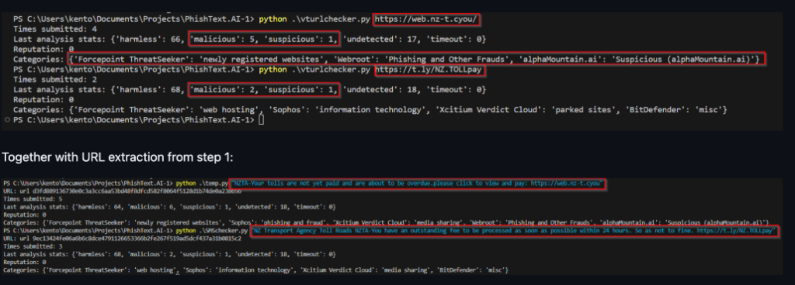

# iSafe - Scam Explanation Assistant

iSafe is a tool built in Python using Streamlit that aims to identify potential manipulation attempts in SMS and text messages. It uses advanced AI language evaluation to evaluate the contents of a message and determine if it exhibits psychological patterns common in scams.

The tool uses a holistic approach to analyze messages:

1.  **AI Analysis**: The tool uses a large language model to analyze the overall text (and any included links contextually). The AI acts as a "Cyber Safety Analyst," identifying manipulation techniques like urgency, authority bias, and fear-mongering.
2.  **Risk Assessment**: It assigns a risk level and explains *why* the message is dangerous.

By using this method, iSafe can provide a detailed explanation of the psychological tricks being used. This helps users avoid falling for scams by educating them on the underlying patterns. The tool is intended as a practical demonstration of how AI can be used to improve digital literacy.



# Usage

## Web Interface

The program provides a user-friendly web interface via Streamlit. This design makes the tool accessible to non-technical users on both desktop and mobile.

To use iSafe:
1.  Paste the suspicious message into the text area.
2.  Click **"Analyze Message for Risk Indicators"**.
3.  Read the Risk Assessment, Explanation, and Safety Guidance.

# Implementation Details

## AI Integration
Using Python, iSafe connects and interacts with an advanced AI model. The function generates a strict system prompt that instructs the AI to act as a safety analyst.

## Risk Assessment Function
iSafe uses the model to provide a human-like assessment. Instead of a simple "Safe/Unsafe" binary, it returns:
*   **Risk Level** (Low/Medium/High)
*   **Techniques**: Specific psychological triggers found in the text.
*   **Explanation**: A plain-language summary of the findings.
*   **Guidance**: Actionable steps for the user.

Example Input:
> "Urgent! Your bank account is locked. Click here to verify."

Example Output:
*   **Risk**: High
*   **Techniques**: Urgency, Fear Mongering, Authority Bias.
*   **Explanation**: The message uses threats of account loss to bypass critical thinking. Real banks do not ask for sensitive info via SMS links.

# Prerequisites and Dependencies

iSafe requires the following Python libraries:
*   `streamlit`
*   `google-generativeai`
*   `python-dotenv`

# Limitations and Risks

*   **Advisory Only**: The accuracy of the solution depends on the effectiveness of the AI model. It does not replace human judgment.
*   **Privacy**: While the app does not store data, users should avoid pasting highly sensitive PII (Personally Identifiable Information).
*   **False Positives**: The model can potentially output false positives or negatives.

# Pseudocode

```text
START

IMPORT streamlit, android_genai_wrapper

FUNCTION analyze_message(text):
    CONFIGURE AI API
    SET System Prompt ("Act as Cyber Safety Analyst...")
    PASS text to Model
    GET JSON response (Risk, Techniques, Explanation)
    RETURN structured data

FUNCTION main:
    RENDER Streamlit UI
    GET user_input
    IF button_clicked:
        CALL analyze_message(user_input)
        DISPLAY results (Color-coded Risk, Explanation, Guidance)
    DISPLAY Ethics & Limitations

RUN main function

END
```
